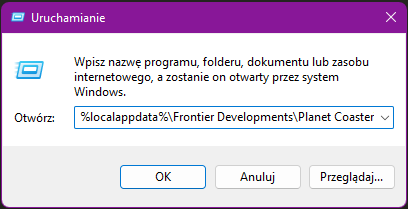
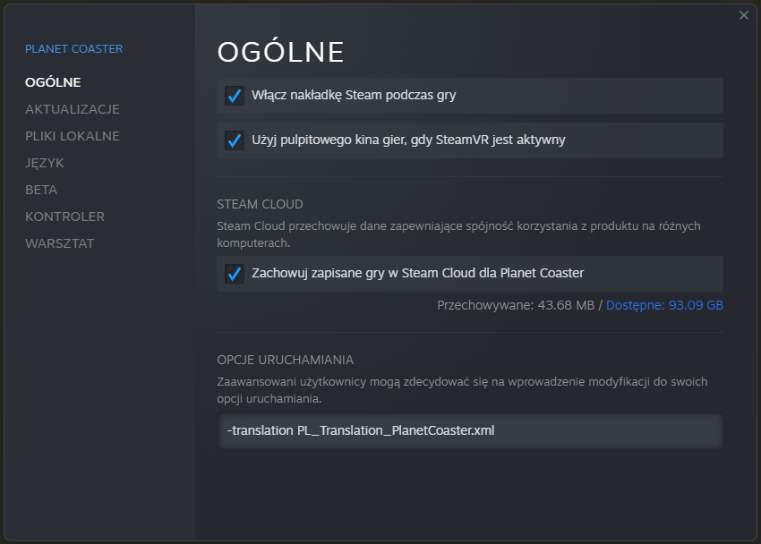

# Planet Coaster - tłumaczenie na Polski

## Indeks

- [Wymagania](#wymagania)
- [Instrukcje instalacji](#instrukcje-instalacji)
- [Oczekiwany wynik końcowy](#oczekiwany-końcowy-wynik)
- [Jak mogę pobrać tłumaczenie z tej dziwnej strony?](#Jak-mogę-pobrać-tłumaczenie-z-tej-dziwnej-strony)
- [Dlaczego tłumaczenie nie jest kompletne / nieaktualne?](#Dlaczego-tłumaczenie-nie-jest-kompletne--nie-jest-aktualne)
- [Znalazłem kilka błędów w tłumaczeniu / Chcę Ci pomóc!](#-Znalazłem-kilka-błędów-w-tłumaczeniu--Chcę-Ci-pomóc)
- [Główni autorzy](#Główni-autorzy)

## Wymagania

Oficjalna kopia Planet Coaster na Steam i Windows.

Tłumaczenie ** nie działa ** z nieoficjalnymi kopiami, na MacOS lub Konsoli.

## Instrukcje Instalacji

1. Otwórz „Uruchom” (naciskając jednocześnie klawisz Windows + R na klawiaturze lub szukając go w menu Start);
2. Wpisz ścieżkę `%localappdata%\Frontier Developments\Planet Coaster\Translations`;

3. Naciśnięcie klawisza enter powinno otworzyć folder, w którym należy umieścić plik .XML o nazwie * PL_Translation_PlanetCoaster.xml *. ** (musisz co najmniej raz uruchomić grę, aby znaleźć ten folder) **;
4. Otwórz Steam, przejdź do swojej biblioteki i kliknij prawym przyciskiem myszy na Planet Coaster. Teraz kliknij Właściwości, a następnie poszukaj pola poniżej „Opcje uruchamiania”;
5. W polu wpisz: `-translation PL_Translation_PlanetCoaster.xml`, a następnie naciśnij Ok;
6. Gotowe, powinieneś mieć teraz grę w języku Polskim, jeśli masz problemy, skontaktuj się z nami na forum [grajpopolsku.pl](https://grajpopolsku.pl/forum/viewtopic.php?t=3457).

(** PS: ** Pamiętaj, że pliki trafiają do folderu `...\Planet Coaster\Translations`, nie twórz podfolderów w "Translations" z plikami w środku lub tłumaczenie nie będzie działać.)

## Oczekiwany wynik końcowy

Ostateczny rezultat poprawnego działania tłumaczenia powinien wyglądać następująco:

## Jak mogę pobrać tłumaczenie z tej dziwnej strony?

- Pierwsza metoda polega na naciśnięciu zielonego przycisku w prawym górnym rogu „Klonuj lub Pobierz” i wybraniu „Pobierz Zip”, spowoduje to pobranie archiwum zip zawierającego plik .xml tłumaczenia, które musisz rozpakować i wstawić do folderu jak wyjaśniono powyżej.

## Dlaczego tłumaczenie nie jest kompletne/nieaktualne?

Minęło dużo czasu, odkąd Planet Coaster wyszedł na PC i niestety zobowiązania naszych tłumaczy bardzo się zmieniły, podczas gdy plik tłumaczenia stawał się coraz większy.

Spowodowało to spowolnienie prac do prawie całkowitego zatrzymania, w konsekwencji tłumaczenie nie jest kompletne i może zawierać wiele błędów, pokornie przepraszam.

Jeśli ktoś chce wnieść swój wkład, zawsze będzie mile widziany.

## Znalazłem kilka błędów w tłumaczeniu / Chcę Ci pomóc!

Nie ma problemu, celowo umieściliśmy go na GitHubie, tutaj każdy może wnieść swój wkład, zarejestrować się na GitHubie i wykonać jeden z tych dwóch kroków:

- Utwórz „Issue” na wypadek, gdybyś chciał zgłosić błędy w tłumaczeniu - [tutaj](https://github.com/hehe202/PlanetCoster/issues).
- Utwórz „Pull request” na wypadek, gdybyś chciał aktywnie przyczynić się do tłumaczenia - [tutaj](https://github.com/hehe202/PlanetCoster/pulls).

** Aby utworzyć „Pull request” ** musisz najpierw wykonać ** „fork” ** (prawy górny przycisk). Po zakończeniu forka wprowadź wszystkie potrzebne zmiany w ** swoim ** repozytorium, a na koniec wyślij nam żądanie Pull (Nowe żądanie Pull> porównaj między forkami).
Możesz sprawdzić plik tłumaczenia pod kątem błędów za pomocą [tego oprogramowania](http://cdn.gulpeyrex.com/communitytranslations/tools/communitytranslationverifier/publish.htm) (Made by Frontier).

## Główni autorzy

- hehe (heHłacz)
- GramBezMonitora
- Pawcio5021

